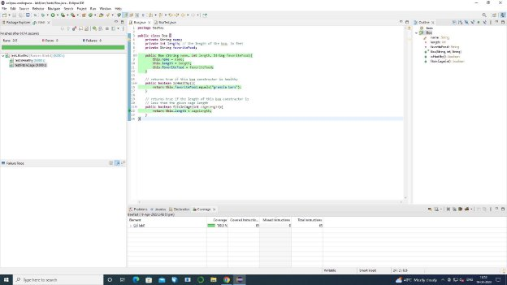
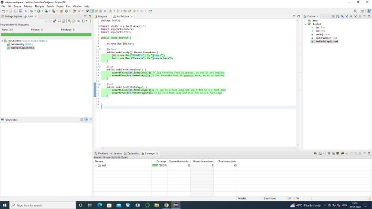
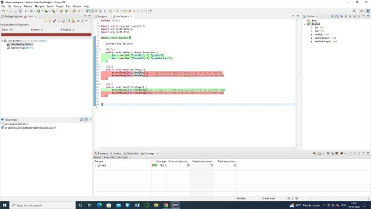
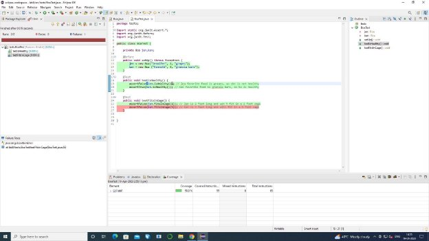
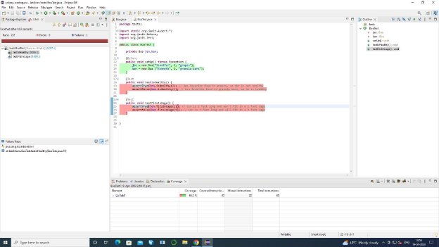
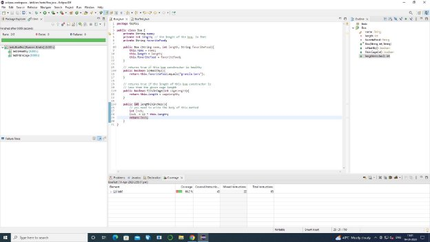
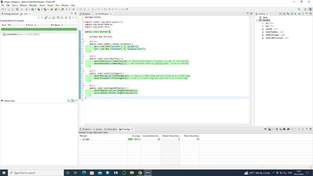
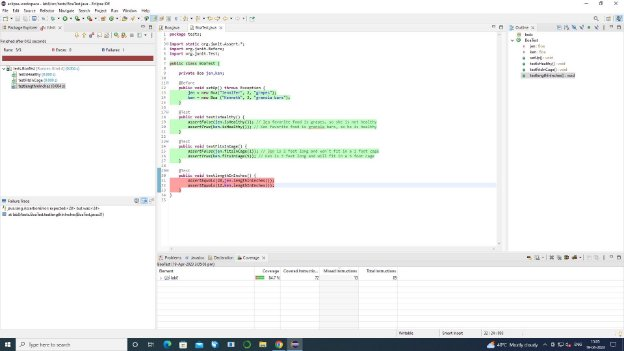
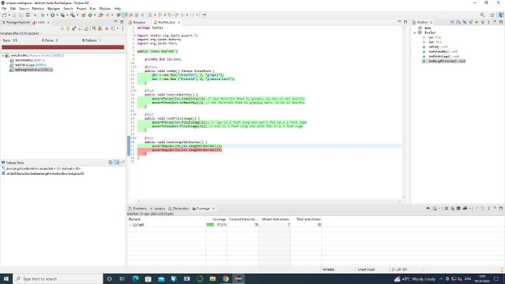

# **LAB - 8**

**Name: Dev Kabra**

**ID: 202001105**

(Codes for Class Boa and BoaTest are in the end)

**1. and 2.** Created a new eclipse project and a class for Boa

**3, 4, 5 and 6.** Different unit tests to test methods isHealthy() and fitsInCage()

**7. and 8.** Created a new method in lengthInInches() in class Boa and wrote unit tests for this method.

**Codes: Class Boa:**

package tests;

public class Boa {

private String name;

private int length; // the length of the boa, in feet private String favoriteFood;

public Boa (String name, int length, String favoriteFood){

this.name = name;

this.length = length;

this.favoriteFood = favoriteFood;

}

// returns true if this boa constructor is healthy

public boolean isHealthy(){

return this.favoriteFood.equals("granola bars"); }

// returns true if the length of this boa constructor is // less than the given cage length

public boolean fitsInCage(int cageLength){

return this.length < cageLength;

}

public int lengthInInches(){

// you need to write the body of this method int Inch;

Inch = 12 \* this.length;

return Inch;

}

}

**Class BoaTest:**

package tests;

import static org.junit.Assert.\*; import org.junit.Before;

import org.junit.Test;

public class BoaTest {

private Boa jen,ken;

@Before

public void setUp() throws Exception {

jen = new Boa("Jennifer", 2, "grapes");

ken = new Boa ("Kenneth", 3, "granola bars");

}

@Test

public void testIsHealthy() {

assertFalse(jen.isHealthy()); // Jen favorite food is grapes, so she is not healthy assertTrue(ken.isHealthy()); // Ken favorite food is granola bars, so he is healthy

}

@Test

public void testFitsInCage() {

assertFalse(jen.fitsInCage(1)); // Jen is 2 feet long and won't fit in a 1 foot cage assertTrue(ken.fitsInCage(5)); // Ken is 3 feet long and will fit in a 5 foot cage

}

@Test

public void testlengthInInches() {

assertEquals(24,jen.lengthInInches());

assertEquals(12,ken.lengthInInches()); }

}
